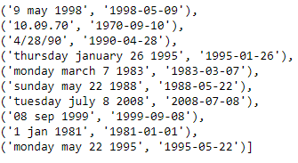

# DeepLearning-Specialization
This repository contains projects that I've done in Deep learning Specialization courses to challenge my DeepLearning skills.

# Emojifier

- Description:

  In this project i've implemented a classifier which tries to suggest an emojie related to the sentence overal meaning.
  
  I've used Glove for Sentence to vector operation.
  
  The image bellow explains the model better:
 
  
  
  This image shows the model architecture:
  
  
  
  # Date Translator

- Description:

  In this project i've implemented a translator model  which tries to convert bad formated Datetime input to it's related yyyy-mm-dd format.
  
  The image bellow Clarifies the dataset better( left: input string representing Date | right: expected output)
 
  
  
  This image shows the model architecture:
  
  
  
